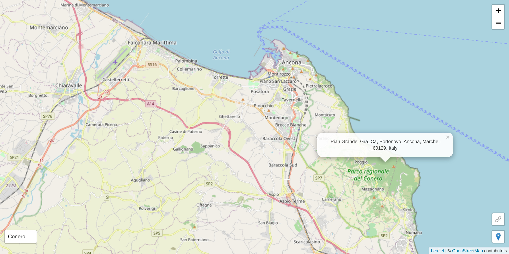

# Simple PWA Map

**[Live PWA](https://webreflection.github.io/map/)**, better saved on Home Screen 😉

## Credits

  * Map by [Leaflet](https://leafletjs.com/)
  * Tiles by [OpenStreetMap](https://www.openstreetmap.org/copyright)
  * Icon by [Twemoji](https://twemoji.twitter.com/)

## Example

## Embedded

See this [live embedded example](https://webreflection.github.io/screenfit/map/), and add `#clean` hash to the `<iframe>` *src* to avoid showing the popup.

## Usage

  * long press (*hold*) to search via reverse geocode
  * click pin 📍 button to move to your location
  * click the link 🔗 button to copy to clipboard and share current map center
  * click on the *input* to search places

## Features

  * once installed as *PWA*, all visited tiles, per each zoom, will be cached (*offline first*)
  * search and reverse search don't work offline
  * everything else does
